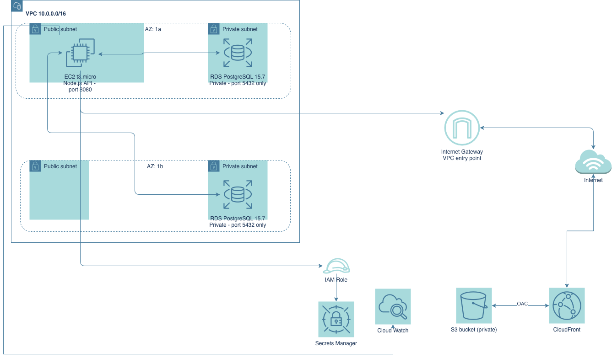

# Cloud Resume Challenge: Backend

Serverless backend for my cloud resume's visitor counter, plus all the infrastructure that hosts the resume itself. Built for the [Cloud Resume Challenge](https://cloudresumechallenge.dev/).

Live site: [cristianxcueva.dev](https://cristianxcueva.dev)

---

## Architecture



Two paths through this stack. The static files (HTML, CSS, JS) flow through CloudFront and S3. The visitor counter is a separate request the browser's JavaScript fires off directly to API Gateway, which triggers Lambda, which reads and writes DynamoDB.

```
Browser -> CloudFront -> S3 (static files)
Browser's JS -> API Gateway -> Lambda -> DynamoDB
```

---

## Tech Stack

| Layer | Service |
|---|---|
| Frontend hosting | S3 + CloudFront |
| DNS / HTTPS | Route 53 + ACM |
| Database | DynamoDB (on-demand) |
| Compute | Lambda (Python 3.12) |
| API | API Gateway (HTTP API) |
| IaC | Terraform, S3 remote backend |
| CI/CD | GitHub Actions |
| Testing | pytest + moto |

---

## What's in This Repo

- `terraform/`: every AWS resource for this project, including the S3 bucket and CloudFront distribution that serve the frontend
- `lambda/`: the visitor counter function and its tests
- `.github/workflows/`: the CI/CD pipeline. Runs tests, then deploys via Terraform if they pass

The frontend repo holds the actual website files and a separate, lighter pipeline that syncs them to S3. It never touches Terraform. The S3 bucket and CloudFront distribution it deploys into already exist, created here.

---

## How the Visitor Counter Works

DynamoDB stores a single item with one attribute: a count. No schema beyond the partition key, the count attribute gets created the first time the Lambda function writes to it.

The Lambda function uses an atomic `update_item()` call with `if_not_exists()`, so the read and the increment happen as one operation. Two requests landing at the same instant can't both read the same starting number and step on each other.

```python
response = table.update_item(
    Key={'id': 'visitor_count'},
    UpdateExpression='SET #c = if_not_exists(#c, :start) + :inc',
    ExpressionAttributeNames={'#c': 'count'},
    ExpressionAttributeValues={':start': 0, ':inc': 1},
    ReturnValues='UPDATED_NEW'
)
```

DynamoDB returns numbers as Python's `Decimal` type, not a plain `int`. `json.dumps()` can't serialize that on its own, so the response wraps it in `int()` before sending it back.

---

## Security Design

- The S3 bucket backing the website is public on purpose, static hosting needs that. CloudFront sits in front with Origin Access Control, so CloudFront is the only thing that ever pulls from S3 directly
- CORS on the API Gateway is locked to `https://cristianxcueva.dev` specifically, not a wildcard, so no other site can call this API from a browser
- Lambda's execution role only has `GetItem` and `UpdateItem` on the one DynamoDB table it needs, nothing broader
- API Gateway throttling caps requests at 5/second sustained, 10 burst. A real visitor generates one request. A script trying to run up a bill gets capped before it ever reaches Lambda or DynamoDB, and capped requests aren't billed
- A CloudWatch billing alarm fires past $10 in estimated charges, a cheap early warning given the actual exposure here is small
- Two separate IAM users handle the CI/CD pipelines, neither has access to my personal AWS credentials. The backend pipeline's user has scoped, per-service permissions instead of account-wide admin access. The frontend pipeline's user is narrower still, it only touches the one S3 bucket and the one CloudFront distribution this project uses

---

## CI/CD

Two repos, two pipelines, on purpose. A frontend change shouldn't trigger a full Terraform run, and a backend change shouldn't touch S3 directly.

**Backend pipeline:** checkout, install dependencies, run pytest against the Lambda function (mocked DynamoDB via moto, no real AWS calls), then `terraform apply` if tests pass.

**Frontend pipeline:** checkout, sync files to S3, invalidate the CloudFront cache.

Both authenticate through dedicated IAM users via GitHub Secrets, never through my own CLI credentials.

This project went through several real CI/CD failures before passing cleanly: an implicit AWS region that worked locally but broke on GitHub's runner, and an IAM policy that didn't grant the automation user permission to manage itself. Both are documented in the commit history.

---

## Tested

This stack has been redeployed multiple times through the live CI/CD pipeline, not just once locally, including recovering correctly from real permission errors along the way. The pipeline currently passes clean on every push.

---

## Known Limitations

No SNS notification on the billing alarm, it has to be checked manually in the console. Given the actual cost exposure here is small, that tradeoff felt reasonable rather than building out email alerting for a low-probability event.

---

## What I Learned

- DynamoDB's atomic update expressions, and why a read-then-write approach has a race condition that `update_item()` with `if_not_exists()` avoids
- The difference between a Lambda execution role (what Lambda can do) and a resource-based permission (who can invoke Lambda), two separate directions of trust
- Why CI/CD credentials need their own, narrower IAM identity instead of reusing personal admin credentials, and why that identity's permissions have to grow every time the infrastructure it manages grows
- Setting up Terraform's S3 backend, including the bootstrap problem: the bucket holding state can't be created by the same configuration that depends on it
- Debugging CI/CD failures with nothing but logs, no local terminal to fall back on

---

## Project History

This started as one repository, built milestone by milestone through the official challenge steps. It got split into this repo and a separate frontend repo once CI/CD needed two independent pipelines. The original, unsplit commit history from Milestones 1 through 6 lives on the `build-history` branch in both repos.

---

## Author

Cristian Cueva, IT Support Analyst transitioning into Cloud Engineering
[GitHub](https://github.com/cristianxcueva)
